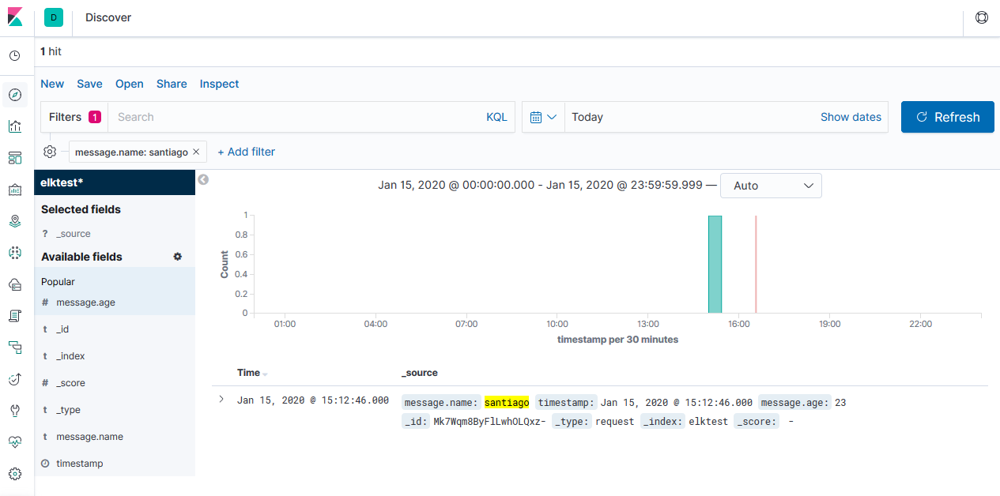

# Kibana and Elasticsearch with docker-compose

```bash
docker-compose up
```
## open kibana 
http://localhost:5601/app/kibana

## create index
method http put --> http://localhost:9200/indexname
```javascript
{
    "settings" : {
        "index" : {
            "number_of_shards" : 1, 
            "number_of_replicas" : 1 
        }
    }
}
```

# send data to Elasticsearch
script that sends data from a local python program to Elasticsearch. 

## Create virtualenv
```bash
virtualenv venv
```
## Activate virtualenv
```bash
.\venv\Scripts\activate.ps1
```
or
```bash
.\venv\Scripts\activate.bat
```

## Installation
```bash
pip install -r requirements.txt
```

## Test
```bash
py .\main.py
```

## imagen Kibana


